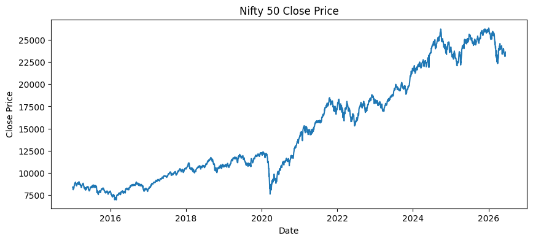
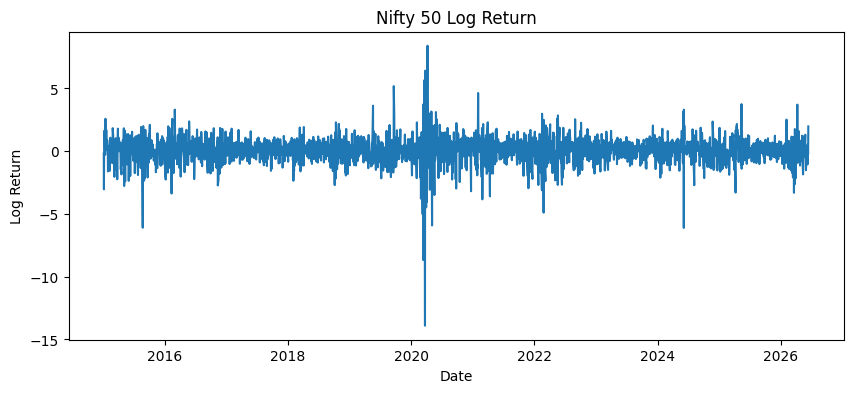
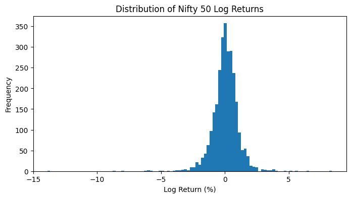

## NSEI-Price-Movement-Tracking
Tracking the movement of prices on the Index of National Stock Exchange of India over a decade (2015-2026)

A foundational project, the first of many leading to the creating of a GARCH model to explore volatility and its influencing factors of the NIFTY 50 Index.

## Overview 
To understand the fundamentals of financial returns, skewness, and kurtosis, a preliminary model is necessary for visual aid.

## Data
Daily close prices of the Nifty 50 Index (Ticker: ^NSEI) downloaded via the Yahoo Finance API, yfinance.

## Methodology
Log returns computed as:
return_t = 100 * log_natural(price_t/price_t-1)

Log returns are utilized due to additive effect as standard practice. This allows better normality at short horizons.

## Key Findings
| Statistic | Value |
|---|---|
| Mean daily return | 0.0419% |
| Daily volatility (SD) | 1.03% |
| Skewness | -1.36 |
| Kurtosis (excess) | 20.54 |

Nifty 50 daily log returns as analysed display stylised features of a financial time series. Mean daily returns are small (0.0419%) and positive, as expected of long term equity growth. The distribution occurs to be left skewed to a significant scale displaying that downside moves are sharper than upside moves. This can be especially observed in the case of the pre and post COVID-19 eras. Excess kurtosis also signals to significant fat tails relative to a normal distribution. This signals a higher occurrence of extreme return days than a normal distribution would predict. 

## Requirements
pandas 
numpy 
matplotlib
yfinance 

## Visualisations

### Closing price over time

### Daily log returns

### Return distribution

